# 🗄️ THIẾT KẾ CƠ SỞ DỮ LIỆU & QUY CHUẨN ORM (DATABASE ARCHITECTURE)

> **Hệ quản trị CSDL**: PostgreSQL 18 / 17  
> **ORM Layer**: SQLAlchemy 2.0 (Type-Safe Mapped Columns)  
> **Migration Tool**: Alembic  
> **Tổng số bảng**: 16 bảng nghiệp vụ (Người dùng, Đơn hàng, Giỏ hàng, Sản phẩm, Đơn vị hành chính Việt Nam, Vận chuyển)

---

## 1. Sơ Đồ Thực Thể Liên Kết (Entity Relationship Diagram - ERD)

```mermaid
erDiagram
    ROLES ||--o{ USERS : "has"
    USERS ||--o{ SHIPPING_ADDRESSES : "owns"
    USERS ||--o{ ORDERS : "places"
    USERS ||--o| CARTS : "owns"
    
    PROVINCES ||--o{ WARDS : "contains"
    ADMINISTRATIVE_UNITS ||--o{ PROVINCES : "defines"
    ADMINISTRATIVE_UNITS ||--o{ WARDS : "defines"
    PROVINCES ||--o{ SHIPPING_ADDRESSES : "locates"
    WARDS ||--o{ SHIPPING_ADDRESSES : "locates"

    CATEGORIES ||--o{ CATEGORIES : "parent_of"
    CATEGORIES ||--o{ PRODUCTS : "contains"
    
    CARTS ||--o{ CART_ITEMS : "contains"
    PRODUCTS ||--o{ CART_ITEMS : "included_in"
    
    ORDERS ||--o{ ORDER_DETAILS : "contains"
    PRODUCTS ||--o{ ORDER_DETAILS : "purchased_in"
    ORDERS ||--o{ ORDER_LOGS : "tracks"
    USERS ||--o{ ORDER_LOGS : "logs_by"

    ROLES {
        int id PK "Mã vai trò"
        string code UK "Mã định danh vai trò (ADMIN, USER, STAFF)"
        string name "Tên hiển thị vai trò (Quản trị viên, Khách hàng...)"
    }

    USERS {
        uuid user_id PK "UUID định danh nội bộ người dùng"
        uuid auth_user_id UK "UUID liên kết Supabase Auth"
        string name "Họ và tên người dùng"
        string username UK "Tên đăng nhập"
        string email UK "Địa chỉ email"
        string phone UK "Số điện thoại"
        boolean is_blocked "Trạng thái khóa tài khoản"
        string avatar_url "URL ảnh đại diện trên Cloudinary"
        string avatar_public_id "Public ID ảnh đại diện Cloudinary"
        date date_of_birth "Ngày sinh"
        string provider "Nguồn đăng nhập (EMAIL, GOOGLE, GITHUB...)"
        int role_id FK "Mã vai trò (Default: 2 - USER)"
        datetime last_login "Thời điểm đăng nhập gần nhất"
        datetime created_at "Thời điểm tạo tài khoản"
        datetime updated_at "Thời điểm cập nhật"
    }

    SHIPPING_ADDRESSES {
        int id PK "Mã định danh địa chỉ"
        uuid user_id FK "Mã người dùng sở hữu (users.user_id)"
        string recipient_name "Tên người nhận hàng"
        string phone "Số điện thoại người nhận"
        string province_code FK "Mã tỉnh/thành phố (provinces.code)"
        string ward_code FK "Mã phường/xã (wards.code)"
        string address_line "Số nhà, tên đường, căn hộ chi tiết"
        boolean is_default "Cờ đánh dấu địa chỉ mặc định"
    }

    PROVINCES {
        string code PK "Mã định danh tỉnh/thành phố (VD: 01, 79)"
        string name "Tên tỉnh/thành phố (Hà Nội, TP. HCM)"
        string name_en "Tên tiếng Anh"
        string full_name "Tên đầy đủ"
        string full_name_en "Tên đầy đủ tiếng Anh"
        string code_name "Tên code chuẩn hóa"
        string postal_code_prefix "Tiền tố mã bưu chính"
        int administrative_unit_id FK "Đơn vị hành chính trực thuộc"
    }

    WARDS {
        string code PK "Mã định danh phường/xã"
        string name "Tên phường/xã"
        string name_en "Tên tiếng Anh"
        string full_name "Tên đầy đủ"
        string full_name_en "Tên đầy đủ tiếng Anh"
        string code_name "Tên code chuẩn hóa"
        string postal_code "Mã bưu chính"
        string province_code FK "Mã tỉnh/thành phố (provinces.code)"
        int administrative_unit_id FK "Đơn vị hành chính trực thuộc"
    }

    ADMINISTRATIVE_UNITS {
        int id PK "Mã định danh đơn vị hành chính"
        string full_name "Tên đầy đủ (Thành phố trực thuộc trung ương, Tỉnh, Phường, Xã)"
        string full_name_en "Tên đầy đủ tiếng Anh"
        string short_name "Tên rút gọn"
        string short_name_en "Tên rút gọn tiếng Anh"
        string code_name "Tên code chuẩn hóa"
        string code_name_en "Tên code tiếng Anh"
    }

    ADMINISTRATIVE_REGIONS {
        int id PK "Mã vùng địa lý/hành chính"
        string name "Tên vùng (Đồng bằng sông Hồng, Đông Nam Bộ...)"
        string name_en "Tên vùng tiếng Anh"
        string code_name "Tên code"
        string code_name_en "Tên code tiếng Anh"
    }

    VN_PROVINCES_METADATA {
        string dataset_version PK "Phiên bản dữ liệu địa chỉ"
        string latest_decree "Nghị định/Quyết định mới nhất áp dụng"
        timestamp generated_at "Thời điểm tạo dữ liệu"
    }

    CATEGORIES {
        int category_id PK "Mã danh mục"
        string category_name UK "Tên danh mục duy nhất"
        int parent_id FK "Mã danh mục cha (cây đa cấp)"
        string slug UK "Đường dẫn tối ưu SEO"
    }

    PRODUCTS {
        int product_id PK "Mã sản phẩm"
        string product_name "Tên sản phẩm"
        numeric price "Giá bán gốc (NUMERIC 38, 2)"
        numeric sale_price "Giá khuyến mãi"
        int discount_percent "% Giảm giá"
        int quantity "Số lượng tồn kho"
        int sold "Số lượng đã bán"
        numeric rating "Điểm đánh giá trung bình (0.0 - 5.0)"
        string brand "Thương hiệu"
        string origin "Xuất xứ"
        string image_src "URL ảnh đại diện sản phẩm"
        text description "Mô tả chi tiết sản phẩm"
        int category_id FK "Danh mục trực thuộc (categories.category_id)"
    }

    CARTS {
        int cart_id PK "Mã giỏ hàng"
        uuid user_id FK,UK "Mã người dùng sở hữu (Quan hệ 1-1)"
    }

    CART_ITEMS {
        int cart_item_id PK "Mã chi tiết giỏ hàng"
        int cart_id FK "Mã giỏ hàng (carts.cart_id)"
        int product_id FK "Mã sản phẩm (products.product_id)"
        int quantity "Số lượng sản phẩm trong giỏ"
    }

    ORDERS {
        string order_id PK "Mã đơn hàng (VD: ORD1727059123)"
        uuid user_id FK "Mã người mua hàng (users.user_id)"
        datetime order_date "Ngày giờ đặt hàng"
        string status "Trạng thái đơn (PENDING, PROCESSING, COMPLETED...)"
        numeric total "Tổng giá trị đơn hàng"
        string shipping_address "Địa chỉ nhận hàng chi tiết"
        string receiver_name "Tên người nhận hàng"
        string shipping_phone "Số điện thoại nhận hàng"
        string payment_method "Hình thức thanh toán (COD, VNPAY, MOMO...)"
        string payment_status "Trạng thái thanh toán (PENDING, PAID, FAILED...)"
        datetime payment_date "Thời điểm thanh toán thành công"
        datetime delivery_date "Ngày giao hàng thực tế/dự kiến"
        int return_period_day "Số ngày cho phép đổi trả (mặc định 7)"
        datetime updated_at "Thời điểm cập nhật đơn"
    }

    ORDER_DETAILS {
        int order_detail_id PK "Mã chi tiết đơn hàng"
        string order_id FK "Mã đơn hàng (orders.order_id)"
        int product_id FK "Mã sản phẩm (products.product_id)"
        int quantity "Số lượng mua"
        numeric price "Đơn giá tại thời điểm mua"
    }

    ORDER_LOGS {
        int id PK "Mã nhật ký đơn hàng"
        string order_id FK "Mã đơn hàng (orders.order_id)"
        string status "Trạng thái đơn tại thời điểm ghi log"
        string description "Mô tả chi tiết hành động / thay đổi"
        uuid user_id FK "Mã người thực hiện thao tác"
        datetime log_date "Thời điểm ghi nhận sự kiện"
        datetime updated_at "Thời điểm cập nhật"
    }

    SHIPPER {
        int shipper_id PK "Mã định danh shipper"
        string name "Tên shipper / Đơn vị vận chuyển"
        string phone "Số điện thoại liên hệ"
        string status "Trạng thái hoạt động (ACTIVE, INACTIVE)"
    }
```



---

## 2. Quy Chuẩn Thiết Kế & Mapping Kiểu Dữ Liệu

1. **Chuẩn đặt tên**: Toàn bộ Database dùng `snake_case`. Tên bảng để số nhiều (`users`, `products`, `orders`, `provinces`, `wards`).
2. **Khóa chính (PK)**:
   - **UUID Native**: Bảng `users.user_id` dùng `UUID(as_uuid=True)`.
   - **Mã chuỗi chuẩn hóa**: `provinces.code` (VD: `"01"`), `wards.code` (VD: `"00001"`), `orders.order_id` (VD: `"ORD1727059123"`).
   - **Integer PK tự tăng**: Dùng cho `roles`, `categories`, `products`, `carts`, `cart_items`, `shipping_addresses`, `order_details`, `order_logs`, `shipper`, `administrative_units`, `administrative_regions`.
3. **Tiền tệ & Giá cả**: Bắt buộc dùng `Numeric(38, 2)` (SQLAlchemy) tương ứng `NUMERIC(38, 2)` trên PostgreSQL. **Tuyệt đối không dùng float/double**.
4. **Xác thực & Người dùng**:
   - Hệ thống xác thực danh tính tích hợp **Supabase Auth** qua cột `auth_user_id` (Unique UUID).
   - Ảnh đại diện lưu trữ trên **Cloudinary** qua `avatar_url` và `avatar_public_id`.
5. **Ràng buộc Khóa Ngoại (Foreign Key Constraints)**:
   - `ondelete="CASCADE"`: Áp dụng cho các quan hệ phụ thuộc hoàn toàn (`cart_items`, `order_details`, `shipping_addresses`, `wards` khi xóa `provinces`).
   - `ondelete="RESTRICT"`: Bảo vệ an toàn dữ liệu lịch sử (`orders` $\rightarrow$ `users`, `order_details` $\rightarrow$ `products`, `users` $\rightarrow$ `roles`).
   - `ondelete="SET NULL"`: Cho phép null an toàn (`categories.parent_id`, `order_logs.user_id`).

---

## 3. Danh Sách 16 Bảng Dữ Liệu Chi Tiết

| STT | Tên bảng | Phân hệ (Module) | Mục đích nghiệp vụ | Khóa chính (PK) | Khóa ngoại & Quan hệ chính |
| :---: | :--- | :--- | :--- | :--- | :--- |
| **1** | `roles` | Auth / Users | Nhóm vai trò người dùng (`ADMIN`, `USER`, `STAFF`) | `id: Integer` | 1-N với `users` |
| **2** | `users` | Auth / Users | Hồ sơ người dùng (liên kết Supabase Auth & Cloudinary) | `user_id: UUID` | N-1 `roles`, 1-N `shipping_addresses`, 1-1 `carts`, 1-N `orders` |
| **3** | `shipping_addresses` | Shipping | Sổ địa chỉ giao hàng của người dùng | `id: Integer` | N-1 `users`, N-1 `provinces`, N-1 `wards` |
| **4** | `provinces` | Locations | Danh mục Tỉnh / Thành phố Việt Nam | `code: String(20)` | N-1 `administrative_units`, 1-N `wards`, 1-N `shipping_addresses` |
| **5** | `wards` | Locations | Danh mục Phường / Xã Việt Nam | `code: String(20)` | N-1 `provinces`, N-1 `administrative_units`, 1-N `shipping_addresses` |
| **6** | `administrative_units`| Locations | Phân loại đơn vị hành chính (Tỉnh, TP, Quận, Phường...) | `id: Integer` | 1-N `provinces`, 1-N `wards` |
| **7** | `administrative_regions`| Locations | Phân vùng kinh tế / địa lý hành chính | `id: Integer` | Danh mục tham chiếu |
| **8** | `vn_provinces_metadata`| Locations | Quản lý phiên bản dữ liệu hành chính & nghị định | `dataset_version: String(50)` | Quản lý metadata |
| **9** | `categories` | Categories | Cây danh mục sản phẩm phân cấp cha - con | `category_id: Integer` | Tự liên kết `parent_id`, 1-N `products` |
| **10**| `products` | Products | Sản phẩm, thông số, giá bán, tồn kho, ảnh | `product_id: Integer` | N-1 `categories`, 1-N `cart_items`, 1-N `order_details` |
| **11**| `carts` | Carts | Giỏ hàng cá nhân người dùng (1 User - 1 Giỏ) | `cart_id: Integer` | 1-1 `users`, 1-N `cart_items` |
| **12**| `cart_items` | Carts | Mặt hàng và số lượng đang nằm trong giỏ | `cart_item_id: Integer` | N-1 `carts`, N-1 `products` |
| **13**| `orders` | Orders | Đơn hàng, thanh toán, ngày giao, trạng thái | `order_id: String(30)` | N-1 `users`, 1-N `order_details`, 1-N `order_logs` |
| **14**| `order_details` | Orders | Danh sách sản phẩm và đơn giá chốt trong đơn | `order_detail_id: Integer` | N-1 `orders`, N-1 `products` |
| **15**| `order_logs` | Orders | Nhật ký theo dõi lịch sử trạng thái đơn hàng | `id: Integer` | N-1 `orders`, N-1 `users` |
| **16**| `shipper` | Shipper | Đơn vị / Nhân viên vận chuyển giao vận | `shipper_id: Integer` | Đơn vị giao nhận |

---

## 4. Hướng Dẫn Kỹ Thuật Viết Model & Migration

### 4.1. Quy tắc viết Model (SQLAlchemy 2.0)
Sử dụng đầy đủ `Mapped` và `mapped_column` type-safe:

```python
import uuid
from sqlalchemy import ForeignKey, Integer, String
from sqlalchemy.dialects.postgresql import UUID
from sqlalchemy.orm import Mapped, mapped_column, relationship
from src.app.core.database import Base
from src.app.modules.locations.model import Province, Ward

class ShippingAddress(Base):
    __tablename__ = "shipping_addresses"

    id: Mapped[int] = mapped_column(Integer, primary_key=True, autoincrement=True)
    user_id: Mapped[uuid.UUID] = mapped_column(
        UUID(as_uuid=True), ForeignKey("users.user_id", ondelete="CASCADE"), index=True, nullable=False
    )
    recipient_name: Mapped[str] = mapped_column(String(255), nullable=False)
    phone: Mapped[str] = mapped_column(String(20), nullable=False)
    province_code: Mapped[str] = mapped_column(String(20), ForeignKey("provinces.code"), nullable=False)
    ward_code: Mapped[str] = mapped_column(String(20), ForeignKey("wards.code"), nullable=False)
    address_line: Mapped[str] = mapped_column(String(255), nullable=False)
    is_default: Mapped[bool] = mapped_column(default=False, nullable=False)

    # Relationships
    user = relationship("User", back_populates="shipping_addresses")
    province: Mapped[Province] = relationship("Province", lazy="select")
    ward: Mapped[Ward] = relationship("Ward", lazy="select")
```

### 4.2. Quy tắc Migration & Seeder
1. Không sửa trực tiếp trên DB, mọi thay đổi qua `alembic revision --autogenerate -m "..."`.
2. Model mới bắt buộc phải được import vào [`alembic/env.py`](file:///d:/Project/shop-app-platform/backend/alembic/env.py).
3. Dữ liệu mẫu khởi tạo qua các script trong `backend/scripts/` và gọi qua `python -m scripts.seed`.
