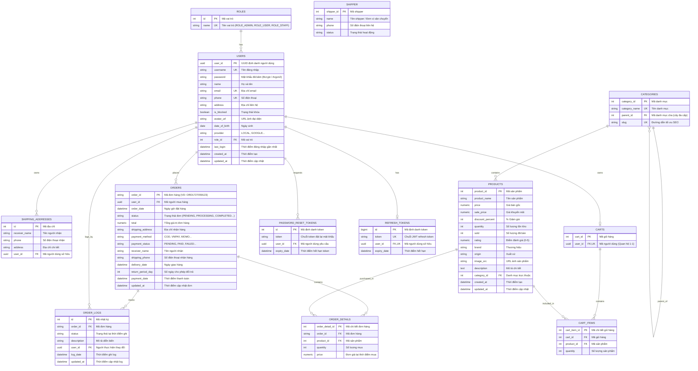

# 🗄️ THIẾT KẾ CƠ SỞ DỮ LIỆU & QUY CHUẨN ORM (DATABASE ARCHITECTURE)

> **Hệ quản trị CSDL**: PostgreSQL 18 / 17  
> **ORM Layer**: SQLAlchemy 2.0 (Type-Safe Mapped Columns)  
> **Migration Tool**: Alembic  
> **Tổng số bảng**: 13 bảng nghiệp vụ

---

## 1. Sơ Đồ Thực Thể Liên Kết (Entity Relationship Diagram - ERD)



---

## 2. Quy Chuẩn Thiết Kế & Mapping Kiểu Dữ Liệu

1. **Chuẩn đặt tên**: Toàn bộ Database dùng `snake_case`. Bảng số nhiều (`users`, `products`, `orders`).
2. **Khóa chính**: UUID Native cho `users.user_id` (`UUID(as_uuid=True)`), Integer PK tự tăng cho các bảng danh mục, sản phẩm, giỏ hàng, đơn hàng chi tiết.
3. **Tiền tệ & Giá cả**: Bắt buộc dùng `Numeric(38, 2)` (SQLAlchemy) tương ứng `NUMERIC(38, 2)` trên PostgreSQL. **Không dùng float/double**.
4. **Audit Fields**: Bảng nghiệp vụ quan trọng luôn có `created_at` (`default=datetime.utcnow`) và `updated_at` (`default=datetime.utcnow, onupdate=datetime.utcnow`).
5. **Ràng buộc Khóa Ngoại**:
   - `ondelete="CASCADE"`: Áp dụng cho các bảng con phụ thuộc tuyệt đối (`cart_items`, `order_details`, `shipping_addresses`, `refresh_token`).
   - `ondelete="RESTRICT"`: Áp dụng bảo vệ dữ liệu tài chính lịch sử (`orders` $\rightarrow$ `users`, `order_details` $\rightarrow$ `products`).
   - `ondelete="SET NULL"`: Áp dụng cho cây danh mục đa cấp `categories.parent_id`.

---

## 3. Danh Sách 13 Bảng Dữ Liệu Chi Tiết

| STT | Tên bảng | Mục đích | Khóa chính (PK) | Quan hệ chính |
| :---: | :--- | :--- | :--- | :--- |
| **1** | `roles` | Nhóm vai trò người dùng (Admin, User, Staff) | `id: Integer` | 1-N với `users` |
| **2** | `users` | Thông tin tài khoản người dùng | `user_id: UUID` | N-1 `roles`, 1-N `shipping_addresses`, 1-1 `carts` |
| **3** | `shipping_addresses` | Sổ địa chỉ giao hàng | `id: Integer` | N-1 với `users` |
| **4** | `categories` | Danh mục sản phẩm phân cấp cha - con | `category_id: Integer` | Tự liên kết `parent_id`, 1-N `products` |
| **5** | `products` | Thông tin sản phẩm, giá, kho, đánh giá | `product_id: Integer` | N-1 `categories` |
| **6** | `carts` | Giỏ hàng người dùng | `cart_id: Integer` | 1-1 `users`, 1-N `cart_items` |
| **7** | `cart_items` | Mặt hàng và số lượng trong giỏ | `cart_item_id: Integer`| N-1 `carts`, N-1 `products` |
| **8** | `orders` | Đơn hàng, tổng tiền, trạng thái giao dịch | `order_id: String(30)` | N-1 `users`, 1-N `order_details`, 1-N `order_logs` |
| **9** | `order_details` | Chi tiết mặt hàng chốt giá trong đơn | `order_detail_id: Integer`| N-1 `orders`, N-1 `products` |
| **10**| `order_logs` | Nhật ký hành trình trạng thái đơn | `id: Integer` | N-1 `orders`, N-1 `users` |
| **11**| `shipper` | Đơn vị vận chuyển (GHTK, GHN, ViettelPost) | `shipper_id: Integer` | Đơn vị giao nhận |
| **12**| `password_reset_token` | Token OTP đặt lại mật khẩu qua email | `id: Integer` | N-1 với `users` |
| **13**| `refresh_token` | Token phiên đăng nhập JWT (Force logout) | `id: BigInteger` | 1-1 với `users` |

---

## 4. Hướng Dẫn Kỹ Thuật Viết Model & Migration

### 4.1. Quy tắc viết Model (SQLAlchemy 2.0)
```python
from sqlalchemy import Integer, String, Numeric, ForeignKey
from sqlalchemy.orm import Mapped, mapped_column, relationship
from src.app.core.database import Base

class CartItem(Base):
    __tablename__ = "cart_items"

    cart_item_id: Mapped[int] = mapped_column(Integer, primary_key=True, autoincrement=True)
    cart_id: Mapped[int] = mapped_column(Integer, ForeignKey("carts.cart_id", ondelete="CASCADE"), index=True)
    product_id: Mapped[int] = mapped_column(Integer, ForeignKey("products.product_id", ondelete="CASCADE"), index=True)
    quantity: Mapped[int] = mapped_column(Integer, default=1, nullable=False)

    cart = relationship("Cart", back_populates="cart_items")
    product = relationship("Product")
```

### 4.2. Quy tắc Migration & Seeder
1. Không sửa trực tiếp trên DB, mọi thay đổi qua `alembic revision --autogenerate -m "..."`.
2. Model mới bắt buộc phải được import vào [`alembic/env.py`](file:///d:/Project/shop-app-platform/backend/alembic/env.py).
3. Dữ liệu mẫu khởi tạo qua các script trong `backend/scripts/` và gọi qua `python -m scripts.seed`.
