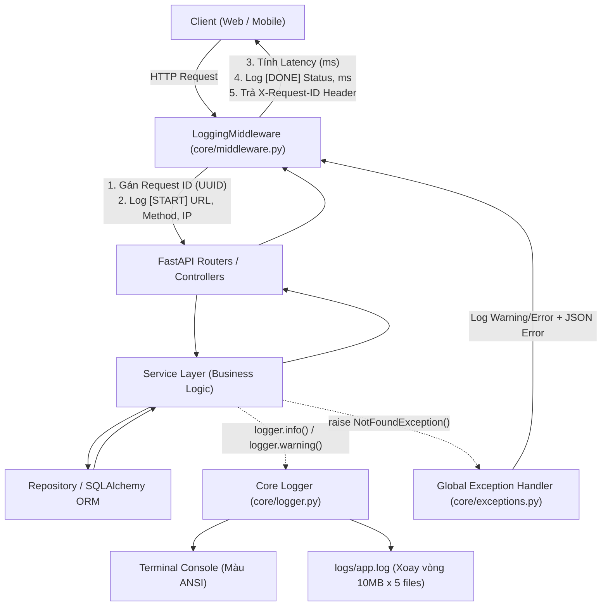

# 📝 HƯỚNG DẪN & QUY CHUẨN HỆ THỐNG LOGGING (SYSTEM LOGGING ARCHITECTURE)

Tài liệu này hướng dẫn chi tiết cách sử dụng hệ thống **Logging tập trung & Request Tracking** trong dự án **Shop App Platform**, được thiết kế theo tiêu chuẩn Enterprise tương đương các hệ thống Java Spring Boot / NestJS.

---

## 1. Tổng Quan Kiến Trúc Logging

Hệ thống Logging của dự án gồm 3 tầng phối hợp chặt chẽ:



---

## 2. So Sánh Với Java Spring Boot

| Khái niệm | Trong Java Spring Boot | Trong Python FastAPI (Dự án này) |
| :--- | :--- | :--- |
| **Ghi Log trong Service/Controller** | `@Slf4j` $\rightarrow$ `log.info("...")` | `from src.app.core.logger import logger` $\rightarrow$ `logger.info("...")` |
| **Truy vết Request (MDC)** | `MDC.put("requestId", uuid)` | `ContextVar` trong `src/app/core/logger.py` $\rightarrow$ Tự động đính kèm `[req_id: ...]` vào mọi dòng log |
| **Tự động bắt mọi Request/Response** | `OncePerRequestFilter` / `@Aspect` AOP | `LoggingMiddleware` trong `src/app/core/middleware.py` |
| **Xử lý Ngoại lệ tập trung** | `@ControllerAdvice` + `@ExceptionHandler` | `register_exception_handlers(app)` trong `src/app/core/exceptions.py` |
| **Cắt xoay vòng file log** | `RollingFileAppender` (Logback XML) | `RotatingFileHandler` (10MB / 5 file backup) |

---

## 3. Các Cấp Độ Log (Log Levels) & Khi Nào Nên Dùng?

| Level | Ý nghĩa | Ví dụ thực tế |
| :--- | :--- | :--- |
| **`DEBUG`** | Thông tin chi tiết phục vụ việc tìm lỗi khi đang code. | `logger.debug(f"Payload parse duoc: {payload}")` |
| **`INFO`** | Các mốc sự kiện bình thường, quan trọng của luồng nghiệp vụ. | `logger.info(f"Nguoi dung {user_id} da tao don hang {order_id} thanh cong.")` |
| **`WARNING`** | Tình huống bất thường nhưng ứng dụng vẫn tự phục hồi hoặc lỗi do client (4xx). | `logger.warning(f"Dang nhap that bai: Sai mat khau cho username={username}")` |
| **`ERROR`** | Lỗi nghiêm trọng, tác vụ thất bại, lỗi kết nối DB, ngoại lệ 500. | `logger.error(f"Khong the ket noi den cong thanh toan VNPAY: {e}", exc_info=True)` |
| **`CRITICAL`** | Hệ thống mất khả năng hoạt động (hỏng DB, sập hạ tầng). | `logger.critical("Database connection pool exhausted!")` |

---

## 4. Hướng Dẫn Sử Dụng Trong Mã Nguồn

### 4.1. Ghi log trong Service hoặc Router
Bất kỳ file nào trong dự án muốn ghi log, chỉ cần import singleton `logger`:

```python
from src.app.core.logger import logger

def process_checkout(user_id: str, cart_id: int):
    logger.info(f"Bat dau thanh toan cho user={user_id}, cart={cart_id}")
    
    # Logic nghiep vu...
    if not cart_items:
        logger.warning(f"Gio hang {cart_id} cua user={user_id} dang rong!")
        raise BadRequestException("Gio hang cua ban dang trong.")
        
    logger.info(f"Thanh toan thanh cong cho user={user_id}")
```

### 4.2. Quy Tắc Bảo Mật Bắt Buộc (Security Rules)

> [!CAUTION]
> **Tuyệt đối KHÔNG ghi log các thông tin nhạy cảm sau:**
> 1. **Mật khẩu thuần hoặc mật khẩu băm** (`password`, `hashed_password`).
> 2. **Token xác thực** (`Authorization` header, `access_token`, `refresh_token`, `secret_key`).
> 3. **Thông tin tài chính** (Số thẻ tín dụng, mã CVV, số tài khoản ngân hàng).
> 4. **Mã xác thực OTP / Reset password PIN**.
