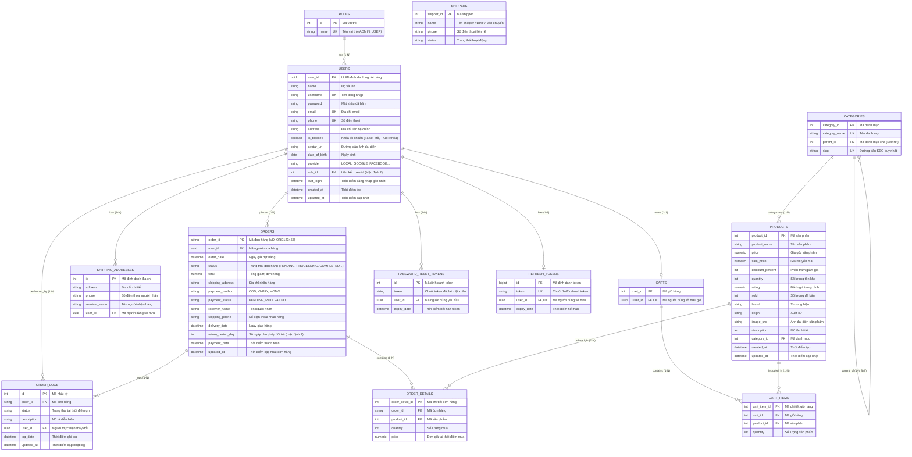

# Tài Liệu Thiết Kế Cơ Sở Dữ Liệu Chi Tiết (Database Specification)
## Dự án: Shop App Platform

Tài liệu này đặc tả chi tiết toàn bộ 13 bảng của hệ thống cơ sở dữ liệu **Shop App Platform** (PostgreSQL 18 & SQLAlchemy 2.0), đồng thời cung cấp hướng dẫn lập trình chuẩn hóa (**Instructions for Agents & Developers**) khi triển khai code Model, Schema, Migration và Seed Data.

---

## 1. Biểu đồ Quan hệ Thực thể Toàn diện (Entity Relationship Diagram - ERD)



---

## 2. Chi Tiết Danh Sách 13 Bảng Dữ Liệu

### 2.1. Bảng `roles` (Vai trò người dùng)
* **Mô tả**: Quản lý nhóm quyền hạn truy cập của hệ thống (ADMIN, USER, STAFF).
* **Tên bảng**: `roles`

| Tên thuộc tính | Kiểu dữ liệu (SQLAlchemy / Postgres) | Ràng buộc | Mô tả |
| :--- | :--- | :--- | :--- |
| `id` | `Integer` | `PK, Autoincrement, NN` | Mã định danh vai trò |
| `name` | `String(255)` | `Unique, NN` | Tên vai trò (`ROLE_ADMIN`, `ROLE_USER`) |

---

### 2.2. Bảng `users` (Người dùng)
* **Mô tả**: Quản lý tài khoản khách hàng, nhân viên và quản trị viên.
* **Tên bảng**: `users`

| Tên thuộc tính | Kiểu dữ liệu (SQLAlchemy / Postgres) | Ràng buộc | Mô tả |
| :--- | :--- | :--- | :--- |
| `user_id` | `UUID(as_uuid=True)` | `PK, default=uuid.uuid4` | Mã định danh người dùng (UUID 16 bytes) |
| `name` | `String(255)` | `Nullable` | Họ và tên hiển thị của người dùng |
| `username` | `String(255)` | `Unique, Index, NN` | Tên đăng nhập |
| `password` | `String(255)` | `NN` | Mật khẩu đã được băm (Bcrypt / Argon2) |
| `email` | `String(255)` | `Unique, Index, Nullable`| Địa chỉ email liên hệ |
| `phone` | `String(255)` | `Unique, Index, Nullable`| Số điện thoại người dùng |
| `address` | `String(255)` | `Nullable` | Địa chỉ mặc định |
| `is_blocked` | `Boolean` | `NN, default=False` | Trạng thái khóa tài khoản (`False`: Bình thường, `True`: Khóa) |
| `avatar_url` | `String(255)` | `Nullable` | URL ảnh đại diện trên CDN Cloudinary |
| `date_of_birth`| `Date` | `Nullable` | Ngày sinh |
| `provider` | `String(255)` | `Nullable, default="LOCAL"`| Nguồn đăng nhập (`LOCAL`, `GOOGLE`, `FACEBOOK`) |
| `role_id` | `Integer` | `FK -> roles.id, NN, default=2` | Vai trò của tài khoản (mặc định 2: User) |
| `last_login` | `DateTime` | `Nullable` | Thời điểm đăng nhập gần nhất |
| `created_at` | `DateTime` | `NN, default=datetime.utcnow` | Thời điểm tạo tài khoản |
| `updated_at` | `DateTime` | `NN, default=datetime.utcnow, onupdate=datetime.utcnow` | Thời điểm cập nhật tài khoản |

---

### 2.3. Bảng `shipping_addresses` (Sổ địa chỉ giao hàng)
* **Mô tả**: Lưu trữ danh sách các địa chỉ giao hàng của từng khách hàng.
* **Tên bảng**: `shipping_addresses`

| Tên thuộc tính | Kiểu dữ liệu (SQLAlchemy / Postgres) | Ràng buộc | Mô tả |
| :--- | :--- | :--- | :--- |
| `id` | `Integer` | `PK, Autoincrement, NN` | Mã định danh địa chỉ |
| `receiver_name`| `String(255)` | `NN` | Tên người nhận hàng |
| `phone` | `String(255)` | `NN` | Số điện thoại nhận hàng |
| `address` | `String(255)` | `NN` | Địa chỉ nhận hàng chi tiết |
| `user_id` | `UUID(as_uuid=True)` | `FK -> users.user_id, ondelete="CASCADE", Index` | Khách hàng sở hữu địa chỉ |

---

### 2.4. Bảng `categories` (Danh mục sản phẩm)
* **Mô tả**: Quản lý cây danh mục sản phẩm đa cấp (hỗ trợ phân cấp cha - con).
* **Tên bảng**: `categories`

| Tên thuộc tính | Kiểu dữ liệu (SQLAlchemy / Postgres) | Ràng buộc | Mô tả |
| :--- | :--- | :--- | :--- |
| `category_id` | `Integer` | `PK, Autoincrement, NN` | Mã định danh danh mục |
| `category_name`| `String(255)` | `Unique, NN` | Tên danh mục |
| `parent_id` | `Integer` | `FK -> categories.category_id, ondelete="SET NULL", Nullable` | Mã danh mục cha (cho cây danh mục đa cấp) |
| `slug` | `String(255)` | `Unique, Index, NN` | Đường dẫn tối ưu SEO |

---

### 2.5. Bảng `products` (Sản phẩm)
* **Mô tả**: Thông tin hàng hóa, giá bán, kho hàng, thương hiệu và thông số kỹ thuật.
* **Tên bảng**: `products`

| Tên thuộc tính | Kiểu dữ liệu (SQLAlchemy / Postgres) | Ràng buộc | Mô tả |
| :--- | :--- | :--- | :--- |
| `product_id` | `Integer` | `PK, Autoincrement, NN` | Mã định danh sản phẩm |
| `product_name` | `String(255)` | `NN` | Tên sản phẩm |
| `price` | `Numeric(38, 2)` | `NN` | Giá niêm yết gốc |
| `sale_price` | `Numeric(38, 2)` | `Nullable` | Giá sau khuyến mãi |
| `discount_percent`| `Integer` | `Nullable` | % Giảm giá |
| `quantity` | `Integer` | `NN, default=0` | Số lượng tồn kho |
| `sold` | `Integer` | `NN, default=0` | Số lượng đã bán |
| `rating` | `Numeric(38, 2)` | `Nullable, default=0.0` | Điểm đánh giá trung bình (0 - 5.0) |
| `brand` | `String(255)` | `Nullable, Index` | Thương hiệu sản phẩm (Apple, HP, XiaoZhu...) |
| `origin` | `String(255)` | `Nullable` | Xuất xứ sản phẩm |
| `image_src` | `String(255)` | `Nullable` | Đường dẫn ảnh CDN Cloudinary |
| `description` | `Text` | `Nullable` | Mô tả chi tiết sản phẩm |
| `category_id` | `Integer` | `FK -> categories.category_id, ondelete="SET NULL", Index` | Danh mục trực thuộc |
| `created_at` | `DateTime` | `NN, default=datetime.utcnow` | Thời điểm tạo sản phẩm |
| `updated_at` | `DateTime` | `NN, default=datetime.utcnow, onupdate=datetime.utcnow` | Thời điểm cập nhật sản phẩm |

---

### 2.6. Bảng `carts` (Giỏ hàng)
* **Mô tả**: Giỏ hàng của từng khách hàng (quan hệ 1-1 với `users`).
* **Tên bảng**: `carts`

| Tên thuộc tính | Kiểu dữ liệu (SQLAlchemy / Postgres) | Ràng buộc | Mô tả |
| :--- | :--- | :--- | :--- |
| `cart_id` | `Integer` | `PK, Autoincrement, NN` | Mã định danh giỏ hàng |
| `user_id` | `UUID(as_uuid=True)` | `FK -> users.user_id, Unique, ondelete="CASCADE", NN` | Mã người dùng sở hữu giỏ hàng |

---

### 2.7. Bảng `cart_items` (Chi tiết giỏ hàng)
* **Mô tả**: Các sản phẩm và số lượng tương ứng trong giỏ hàng.
* **Tên bảng**: `cart_items`

| Tên thuộc tính | Kiểu dữ liệu (SQLAlchemy / Postgres) | Ràng buộc | Mô tả |
| :--- | :--- | :--- | :--- |
| `cart_item_id` | `Integer` | `PK, Autoincrement, NN` | Mã chi tiết mục giỏ hàng |
| `cart_id` | `Integer` | `FK -> carts.cart_id, ondelete="CASCADE", NN, Index` | Giỏ hàng chứa mục này |
| `product_id` | `Integer` | `FK -> products.product_id, ondelete="CASCADE", NN, Index` | Sản phẩm được chọn |
| `quantity` | `Integer` | `NN, default=1` | Số lượng sản phẩm |

---

### 2.8. Bảng `orders` (Đơn hàng)
* **Mô tả**: Thông tin đơn hàng, tổng tiền, trạng thái giao dịch và thanh toán.
* **Tên bảng**: `orders`

| Tên thuộc tính | Kiểu dữ liệu (SQLAlchemy / Postgres) | Ràng buộc | Mô tả |
| :--- | :--- | :--- | :--- |
| `order_id` | `String(30)` | `PK, NN` | Mã định danh đơn hàng (VD: `ORD1727059123`) |
| `user_id` | `UUID(as_uuid=True)` | `FK -> users.user_id, NN, Index` | Người mua hàng |
| `order_date` | `DateTime` | `NN, default=datetime.utcnow` | Thời điểm đặt đơn |
| `status` | `String(50)` | `NN, Index` | Trạng thái đơn (`PENDING`, `PROCESSING`, `SHIPPED`, `COMPLETED`, `CANCELLED`) |
| `total` | `Numeric(38, 2)` | `NN` | Tổng giá trị đơn hàng |
| `shipping_address`| `String(255)` | `NN` | Địa chỉ nhận hàng |
| `receiver_name` | `String(255)` | `NN` | Tên người nhận hàng |
| `shipping_phone` | `String(255)` | `NN` | Số điện thoại nhận hàng |
| `payment_method` | `String(255)` | `Nullable` | Hình thức thanh toán (`COD`, `VNPAY`, `MOMO`, `CREDIT_CARD`) |
| `payment_status` | `String(50)` | `NN, default="PENDING"` | Trạng thái thanh toán (`PENDING`, `PAID`, `FAILED`, `REFUNDED`) |
| `payment_date` | `DateTime` | `Nullable` | Thời điểm thanh toán thành công |
| `delivery_date` | `DateTime` | `Nullable` | Ngày giao hàng thực tế/dự kiến |
| `return_period_day`| `Integer` | `NN, default=7` | Số ngày cho phép đổi trả |
| `updated_at` | `DateTime` | `NN, default=datetime.utcnow, onupdate=datetime.utcnow` | Thời điểm cập nhật đơn hàng |

---

### 2.9. Bảng `order_details` (Chi tiết đơn hàng)
* **Mô tả**: Danh sách sản phẩm, số lượng và giá chốt tại thời điểm mua trong đơn hàng.
* **Tên bảng**: `order_details` (hoặc `order_detail`)

| Tên thuộc tính | Kiểu dữ liệu (SQLAlchemy / Postgres) | Ràng buộc | Mô tả |
| :--- | :--- | :--- | :--- |
| `order_detail_id`| `Integer` | `PK, Autoincrement, NN` | Mã định danh chi tiết đơn |
| `order_id` | `String(30)` | `FK -> orders.order_id, ondelete="CASCADE", NN, Index` | Đơn hàng liên kết |
| `product_id` | `Integer` | `FK -> products.product_id, ondelete="RESTRICT", NN, Index` | Sản phẩm được mua |
| `quantity` | `Integer` | `NN` | Số lượng mua |
| `price` | `Numeric(38, 2)` | `NN` | Giá bán của sản phẩm tại thời điểm đặt hàng |

---

### 2.10. Bảng `order_logs` (Nhật ký trạng thái đơn hàng)
* **Mô tả**: Ghi vết lịch sử thay đổi trạng thái của đơn hàng phục vụ kiểm toán và theo dõi hành trình đơn.
* **Tên bảng**: `order_logs` (hoặc `order_log`)

| Tên thuộc tính | Kiểu dữ liệu (SQLAlchemy / Postgres) | Ràng buộc | Mô tả |
| :--- | :--- | :--- | :--- |
| `id` | `Integer` | `PK, Autoincrement, NN` | Mã định danh bản ghi log |
| `order_id` | `String(30)` | `FK -> orders.order_id, ondelete="CASCADE", NN, Index` | Đơn hàng được theo dõi |
| `status` | `String(50)` | `Nullable` | Trạng thái đơn tại thời điểm ghi log |
| `description` | `String(255)` | `Nullable` | Mô tả chi tiết hành động / diễn biến |
| `user_id` | `UUID(as_uuid=True)` | `FK -> users.user_id, Nullable` | Người thao tác (khách hàng hoặc admin) |
| `log_date` | `DateTime` | `NN, default=datetime.utcnow` | Thời điểm ghi nhận sự kiện |
| `updated_at` | `DateTime` | `NN, default=datetime.utcnow, onupdate=datetime.utcnow` | Thời điểm cập nhật log |

---

### 2.11. Bảng `shipper` (Đơn vị / Nhân viên vận chuyển)
* **Mô tả**: Thông tin các đối tác vận chuyển giao nhận hàng.
* **Tên bảng**: `shipper`

| Tên thuộc tính | Kiểu dữ liệu (SQLAlchemy / Postgres) | Ràng buộc | Mô tả |
| :--- | :--- | :--- | :--- |
| `shipper_id` | `Integer` | `PK, Autoincrement, NN` | Mã định danh shipper |
| `name` | `String(50)` | `NN` | Tên shipper / Đơn vị vận chuyển (GHTK, GHN, ViettelPost...) |
| `phone` | `String(10)` | `NN` | Số điện thoại liên hệ |
| `status` | `String(50)` | `Nullable, default="ACTIVE"`| Trạng thái hoạt động (`ACTIVE`, `INACTIVE`) |

---

### 2.12. Bảng `password_reset_token` (Mã khôi phục mật khẩu)
* **Mô tả**: Lưu mã token tạm thời khi người dùng yêu cầu đặt lại mật khẩu qua email.
* **Tên bảng**: `password_reset_token`

| Tên thuộc tính | Kiểu dữ liệu (SQLAlchemy / Postgres) | Ràng buộc | Mô tả |
| :--- | :--- | :--- | :--- |
| `id` | `Integer` | `PK, Autoincrement, NN` | Mã định danh bản ghi |
| `token` | `String(255)` | `NN, Index` | Chuỗi token bảo mật dùng 1 lần |
| `user_id` | `UUID(as_uuid=True)` | `FK -> users.user_id, ondelete="CASCADE", NN` | Tài khoản yêu cầu |
| `expiry_date` | `DateTime` | `NN` | Thời gian hết hạn của token |

---

### 2.13. Bảng `refresh_token` (Token làm mới JWT)
* **Mô tả**: Lưu trữ token làm mới phiên đăng nhập (Refresh Token) cho hệ thống xác thực.
* **Tên bảng**: `refresh_token`

| Tên thuộc tính | Kiểu dữ liệu (SQLAlchemy / Postgres) | Ràng buộc | Mô tả |
| :--- | :--- | :--- | :--- |
| `id` | `BigInteger` | `PK, Autoincrement, NN` | Mã định danh bản ghi |
| `token` | `String(255)` | `Unique, Index, NN` | Chuỗi Refresh Token duy nhất |
| `user_id` | `UUID(as_uuid=True)` | `FK -> users.user_id, Unique, ondelete="CASCADE", NN` | Tài khoản sở hữu phiên đăng nhập (1-1) |
| `expiry_date` | `DateTime` | `NN` | Thời gian hết hạn của refresh token |

---

## 3. Hướng Dẫn Kỹ Thuật Cho Agent & Developers (Instructions)

Khi viết mã nguồn SQLAlchemy Models, Pydantic Schemas, Migration và Seeder, Agent và Developer **bắt buộc** phải tuân theo các quy chuẩn sau:

### 3.1. Cấu trúc thư mục Module trong Backend
Mỗi module nghiệp vụ nằm trong thư mục [`backend/src/app/modules/<tên_module>/`](file:///d:/Project/shop-app-platform/backend/src/app/modules):
```text
backend/src/app/modules/<module_name>/
├── __init__.py
├── model.py        # Định nghĩa SQLAlchemy ORM Model
├── schema.py       # Định nghĩa Pydantic Request / Response DTOs
├── router.py       # Định nghĩa FastAPI Endpoints (APIRouter)
└── service.py      # Logic nghiệp vụ & tương tác Database (nếu có)
```

### 3.2. Quy tắc viết Model (SQLAlchemy 2.0 Modern Standard)
1. Kế thừa từ class [`Base`](file:///d:/Project/shop-app-platform/backend/src/app/core/database.py#L7) (`from src.app.core.database import Base`).
2. Luôn sử dụng cú pháp Type Hint `Mapped[type] = mapped_column(...)`.
3. Kiểu `UUID` trong PostgreSQL:
   ```python
   import uuid
   from sqlalchemy.dialects.postgresql import UUID
   from sqlalchemy.orm import Mapped, mapped_column

   class User(Base):
       __tablename__ = "users"
       user_id: Mapped[uuid.UUID] = mapped_column(
           UUID(as_uuid=True), primary_key=True, default=uuid.uuid4
       )
   ```
4. Kiểu số tiền `Numeric(38, 2)`:
   ```python
   from decimal import Decimal
   from sqlalchemy import Numeric
   from sqlalchemy.orm import Mapped, mapped_column

   price: Mapped[Decimal] = mapped_column(Numeric(38, 2), nullable=False)
   ```
5. Khai báo quan hệ hai chiều `relationship` và `ForeignKey`:
   ```python
   from sqlalchemy import ForeignKey, Integer
   from sqlalchemy.orm import Mapped, mapped_column, relationship

   # Trong Product model
   category_id: Mapped[int | None] = mapped_column(
       Integer, ForeignKey("categories.category_id", ondelete="SET NULL"), nullable=True
   )
   category: Mapped["Category"] = relationship("Category", back_populates="products")
   ```

### 3.3. Quy tắc viết Pydantic Schemas (DTO)
- Luôn bật cấu hình `model_config = ConfigDict(from_attributes=True)` để Pydantic tự động đọc trực tiếp từ SQLAlchemy ORM Model.
- Tách biệt rõ `CreateSchema`, `UpdateSchema` và `ResponseSchema`.
- Sử dụng `Decimal` cho tiền tệ và `uuid.UUID` cho định danh User.

### 3.4. Quy tắc Đăng ký Migration với Alembic
Mỗi khi tạo Model mới, **bắt buộc import Model vào [`backend/alembic/env.py`](file:///d:/Project/shop-app-platform/backend/alembic/env.py)**:
```python
# backend/alembic/env.py
from src.app.modules.roles.model import Role # noqa: F401
from src.app.modules.users.model import User # noqa: F401
from src.app.modules.orders.model import Order # noqa: F401
...
```
Sau đó tạo migration bằng lệnh:
```powershell
uv run alembic revision --autogenerate -m "create <tên_bảng> table"
uv run alembic upgrade head
```

### 3.5. Quy tắc viết Script Seed Data
- Tạo file riêng trong `backend/scripts/seed_<tên_module>.py`.
- Sử dụng phương thức `db.merge(Model(**data))` thay vì `db.add` để đảm bảo script có tính chất **Idempotent** (chạy nhiều lần không bị trùng lặp dữ liệu hay vỡ khóa chính).
- Đăng ký hàm gọi vào [`backend/scripts/seed.py`](file:///d:/Project/shop-app-platform/backend/scripts/seed.py) theo đúng thứ tự phụ thuộc khóa ngoại.
