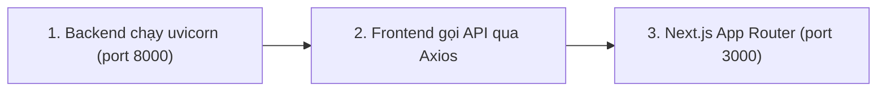

# Hướng Dẫn Thao Tác Nhanh Phía Frontend (Next.js Cheatsheet)

Tổng hợp các lệnh và quy trình thao tác nhanh khi phát triển giao diện người dùng **Shop App Platform**.

---

## 1. Cài Đặt & Cấu Hình Môi Trường Ban Đầu

> Chạy tại thư mục `frontend/`

```bash
# 1. Cài đặt toàn bộ dependencies (Khuyên dùng pnpm)
pnpm install

# 2. Tạo file cấu hình môi trường local từ bản mẫu
cp .env.local.example .env.local
```

### Nội dung cấu hình `.env.local`:
```env
NEXT_PUBLIC_API_URL=http://localhost:8000/api/v1
NEXT_PUBLIC_APP_NAME="Shop App Platform"
```

---

## 2. Các Lệnh Khởi Chạy & Biên Dịch (Commands)

```bash
# Chạy môi trường phát triển (Hot-Reload)
pnpm dev
# -> Mở trình duyệt tại: http://localhost:3000

# Kiểm tra lỗi cú pháp & Linter
pnpm lint

# Format toàn bộ mã nguồn
pnpm format

# Build mã nguồn cho môi trường Production
pnpm build

# Chạy bản build Production
pnpm start
```

---

## 3. Quy Trình Phối Hợp Backend ⟷ Frontend


