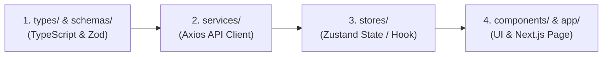
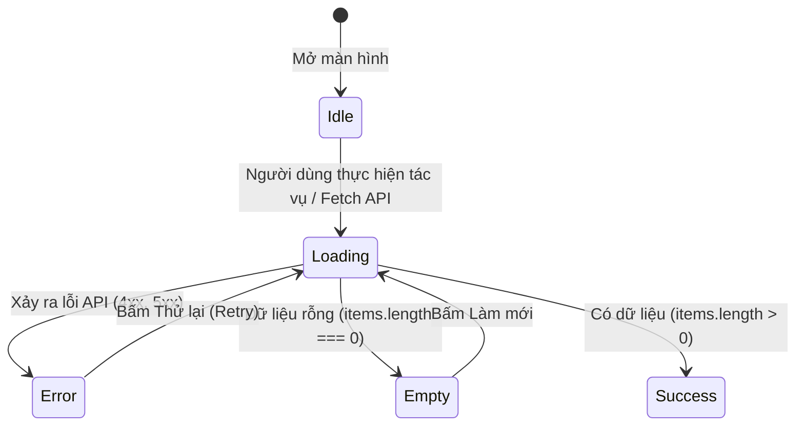

# 🎨 QUY CHUẨN PHÁT TRIỂN FRONTEND (FRONTEND STANDARDS)

> **Áp dụng cho**: Toàn bộ lập trình viên Frontend (Next.js 15 / React 19 / TypeScript / Tailwind CSS / Zustand).  
> **Mục tiêu**: Đảm bảo cấu trúc Feature-Driven rõ ràng, trải nghiệm người dùng mượt mà, type-safe từ API đến giao diện và xử lý đầy đủ các trạng thái UI.

---

## 1. Triển Khai Song Song Trọn Gói (Full Feature Ownership)

Mỗi thành viên khi phụ trách một module nghiệp vụ sẽ thực hiện theo **quy trình 4 bước chuẩn**:



1. **Bước 1 (`types/` & `schemas/`)**: Khai báo TypeScript Interfaces và Zod Schema để validate form.
2. **Bước 2 (`services/`)**: Xây dựng hàm gọi API thông qua Axios Client (kế thừa các kiểu DTO từ bước 1).
3. **Bước 3 (`stores/`)**: Tạo Zustand Store hoặc Custom Hook quản lý State, gọi API và lưu trữ dữ liệu.
4. **Bước 4 (`components/` & `app/`)**: Xây dựng các UI Components và gắn vào trang tương ứng trong `app/`.

---

## 2. Cấu Trúc Thư Mục Feature-Driven & Quy Tắc Đặt Tên

Mọi mã nguồn liên quan đến một tính năng được gom gọn vào thư mục `src/features/[feature-name]/`:

```text
frontend/src/
├── app/                        # Next.js App Router (layout.tsx, page.tsx, error.tsx, loading.tsx)
│   ├── (auth)/                 # Route Group cho Đăng nhập / Đăng ký
│   ├── (shop)/                 # Route Group cho Trang chủ, Danh mục, Chi tiết SP, Giỏ hàng
│   └── (admin)/                # Route Group cho Quản trị viên
│
├── components/ui/              # Base UI Kit dùng chung (Button, Modal, Input, Toast, Skeleton, EmptyState)
├── lib/                        # Tiện ích chung (axios client, utils, formatters)
│
└── features/                   # Chứa toàn bộ các Feature Modules độc lập
    ├── auth/                   # Đăng nhập, Đăng ký, Quên mật khẩu
    ├── products/               # Danh sách sản phẩm, Chi tiết sản phẩm, Bộ lọc
    ├── categories/             # Danh mục sản phẩm đa cấp
    ├── cart/                   # Giỏ hàng & Mini-cart
    ├── orders/                 # Đặt hàng, Lịch sử đơn hàng, Tracking
    └── dashboard/              # Báo cáo thống kê Admin
        ├── types/              # TypeScript Types / Interfaces
        ├── schemas/            # Zod validation schemas
        ├── services/           # Axios API services
        ├── stores/             # Zustand State stores
        └── components/         # Feature UI components
```

### Quy tắc đặt tên (Naming Convention):

| Đối tượng | Quy tắc đặt tên | Ví dụ chuẩn |
| :--- | :--- | :--- |
| **Tên File & Thư mục** | `kebab-case` | `product-service.ts`, `use-product-store.ts`, `category-card.tsx` |
| **UI Component (React)**| `PascalCase` | `ProductList.tsx`, `CategoryModal.tsx`, `OrderSummary.tsx` |
| **Zod Schema** | `camelCase` + `Schema` | `categoryFormSchema`, `productCreateSchema`, `loginSchema` |
| **API Service** | `camelCase` + `Service`| `productService`, `authService`, `orderService` |
| **Zustand Store Hook** | `use` + `PascalCase` + `Store` | `useProductStore`, `useCartStore`, `useAuthStore` |

---

## 3. Quản Lý Đủ 4 Trạng Thái UI (4 UI States)

Mọi màn hình danh sách, bảng dữ liệu hoặc form submit **bắt buộc phải xử lý trọn vẹn 4 trạng thái giao diện**:



1. **`Idle`**: Trạng thái nghỉ ban đầu khi chưa kích hoạt tác vụ.
2. **`Loading`**: 
   - Với Bảng / Danh sách thẻ: **Bắt buộc dùng Skeleton** (khung xám nhấp nháy mô phỏng layout thật), không dùng màn hình trắng trơn.
   - Với Nút bấm / Form submit: Hiển thị Spinner nhỏ và `disabled` nút bấm.
3. **`Error`**: 
   - Hiển thị Alert hoặc Toast thông báo lỗi lấy trực tiếp từ Backend: `error.response?.data?.message || "Đã có lỗi xảy ra"`.
   - Có nút **"Thử lại" (Retry)**.
4. **`Empty State`**: 
   - Khi danh sách rỗng (`items.length === 0`), không để bảng trống trơn.
   - Hiển thị hình ảnh/icon minh họa + dòng mô tả thân thiện + Nút hành động kêu gọi **(CTA - Call To Action)** (ví dụ: *"Chưa có sản phẩm nào. [Thêm sản phẩm ngay]"*).

---

## 4. Client-side Form Validation (React Hook Form + Zod)

Tất cả các Form nhập liệu ở Frontend **bắt buộc sử dụng React Hook Form kết hợp với Zod Resolver** để validate dữ liệu ngay trên client trước khi gửi request tới Backend.

### 4.1. Khai báo Schema (`features/categories/schemas/category-schema.ts`)
```typescript
import { z } from "zod";

export const categoryFormSchema = z.object({
  category_name: z
    .string()
    .min(2, "Tên danh mục phải có tối thiểu 2 ký tự")
    .max(100, "Tên danh mục tối đa 100 ký tự")
    .trim(),
  parent_id: z.number().nullable().optional(),
  slug: z
    .string()
    .min(2, "Slug tối thiểu 2 ký tự")
    .regex(/^[a-z0-9-]+$/, "Slug chỉ được chứa chữ thường, số và dấu gạch ngang")
    .optional(),
});

export type CategoryFormValues = z.infer<typeof categoryFormSchema>;
```

### 4.2. Sử dụng trong Component (`features/categories/components/CategoryModal.tsx`)
```tsx
"use client";

import { useForm } from "react-hook-form";
import { zodResolver } from "@hookform/resolvers/zod";
import { categoryFormSchema, CategoryFormValues } from "../schemas/category-schema";

export function CategoryModal({ onSubmitSuccess }: { onSubmitSuccess: () => void }) {
  const {
    register,
    handleSubmit,
    formState: { errors, isSubmitting },
    reset,
  } = useForm<CategoryFormValues>({
    resolver: zodResolver(categoryFormSchema),
    defaultValues: {
      category_name: "",
      parent_id: null,
    },
  });

  const onSubmit = async (data: CategoryFormValues) => {
    try {
      // Goi API thong qua service
      // await categoryService.create(data);
      reset();
      onSubmitSuccess();
    } catch (error: any) {
      // Hien thi Toast thong bao loi
      console.error(error);
    }
  };

  return (
    <form onSubmit={handleSubmit(onSubmit)} className="space-y-4">
      <div>
        <label className="block text-sm font-medium text-gray-700">Tên danh mục</label>
        <input
          {...register("category_name")}
          type="text"
          className="mt-1 block w-full rounded-md border p-2 text-sm"
          placeholder="Nhập tên danh mục..."
        />
        {errors.category_name && (
          <p className="mt-1 text-xs text-red-600">{errors.category_name.message}</p>
        )}
      </div>

      <button
        type="submit"
        disabled={isSubmitting}
        className="w-full rounded bg-blue-600 py-2 text-white hover:bg-blue-700 disabled:opacity-50"
      >
        {isSubmitting ? "Đang lưu..." : "Lưu danh mục"}
      </button>
    </form>
  );
}
```
