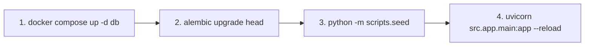

# Hướng Dẫn Thao Tác Nhanh (Cheatsheet & Instructions)

Tổng hợp các câu lệnh thường dùng trong quá trình phát triển dự án **Shop App Platform**.

---

## 1. Khởi động Cơ sở dữ liệu (Docker)
> Chạy tại thư mục gốc `shop-app-platform/`

```powershell
# Bật Database PostgreSQL chạy ngầm
docker compose up -d db

# Kiểm tra trạng thái container
docker compose ps

# Tắt Database (giữ nguyên dữ liệu)
docker compose stop db

# Reset toàn bộ Database & Volume dữ liệu
docker compose down -v
```

---

## 2. Quản lý Database Migration (Alembic)
> Chạy tại thư mục `backend/`

```powershell
# Tạo file migration tự động khi thay đổi Model
alembic revision --autogenerate -m "mo_ta_thay_doi"

# Cập nhật database lên phiên bản mới nhất
alembic upgrade head

# Rollback (quay lui) 1 bước migration gần nhất
alembic downgrade -1

# Xem lịch sử các migration
alembic history
```

---

## 3. Nạp Dữ Liệu Mẫu (Seed Data)
> Chạy tại thư mục `backend/` sau khi đã chạy `alembic upgrade head`

```powershell
# Nạp toàn bộ dữ liệu mẫu (Users, Categories, Products...)
python -m scripts.seed
```

---

## 4. Chạy Backend API (FastAPI)
> Chạy tại thư mục `backend/`

```powershell
# Khởi động Backend với chế độ Hot-Reload
uvicorn src.app.main:app --reload --port 8000
```
- **API URL**: `http://localhost:8000`
- **Swagger Docs**: `http://localhost:8000/docs`
- **ReDoc**: `http://localhost:8000/redoc`

---

## 5. Quản lý Thư viện & Môi trường ảo (`uv`)
> Chạy tại thư mục `backend/`

```powershell
# Cài đặt / Đồng bộ toàn bộ thư viện từ pyproject.toml
uv sync

# Thêm một thư viện mới vào dự án
uv add <ten_thu_vien>

# Chạy một lệnh Python qua môi trường ảo mà không cần activate
uv run <command>
```

---

## 6. Quy trình làm việc tiêu chuẩn (Standard Dev Flow)


